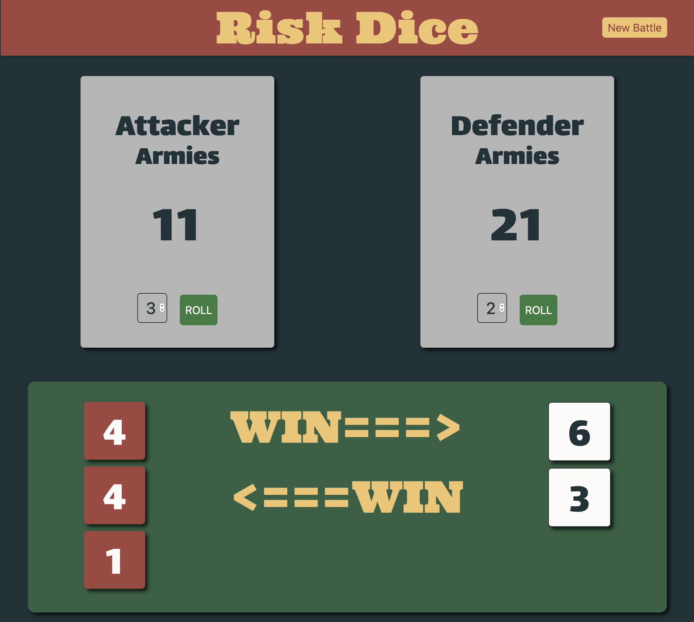

# Risk Dice Game

This app takes the dice battle element from the strategy board game Risk.  It is primarily implemented using classes in javascript.

  

## How to Play

1.  Click *New Battle* in the upper right corner.
2.  Type in the number of armies for the attacking player.
3.  Type in the number of armies for the defending player.
4.  Click *Start Battle*.
5.  Each player picks 1, 2, or 3 armies to battle.
6.  Each player presses *Roll*.
7.  Results are displayed at the bottom.
8.  Return to step 5 for another round with the current army counts.
9.  Return to step 1 to start a new battle.

### Number of Dice to Roll

The number of dice to roll may vary from 1 to 3 dice.  A pop up window will alert the player if they rolling too many dice.
*  The attacker must always roll at least one die count less than the army count.
  *  Attacker has 3 armies remaining.  The most dice that may be rolled is 2
*  The defender must always roll less than or equal to the army count.
  *  Defender has 2 armies remaining.  The most dice that may be rolled is 2.
  

### Scoring
1.  The loser of a roll loses 1 army.
2.  The highest roll of each player is compared.  The higher die wins.
3.  Ties go to the defender.
4.  If each player rolled at least 2 die, the second highest die for each player is compared.
5.  If either player rolls more total die than the second player,  the lowest unmatched rolls are ignored.
    *  Example:
        *  Attacker rolls 3 dice.
        *  Defender rolls 2 dice.
        *  Only the attacker's top 2 die are used, the 3rd die is ignored.

