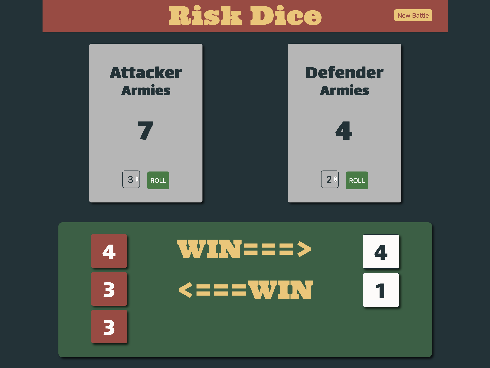

<!-- PROJECT LOGO -->
 

  <h1 align="center">Risk Dice Game</h1>

  <h3 align="center">
    Execute your Risk board game battles in an app.

  </h3>

<!-- TABLE OF CONTENTS -->

  
Table of Contents

  <ol>
    <li>
      <a href="#about-the-project">About The Project</a>
      <ul>
        <li><a href="#built-with">Built With</a></li>
      </ul>
    </li>
    <li>
      <a href="#getting-started">Getting Started</a>
      <ul>
        <li><a href="#how-to-play">How to Play</a></li>
        <li><a href="#how-to-play">Number of Dice to Roll</a></li>
        <li><a href="#how-to-play">Scoring</a></li>
      </ul>
    </li>
    <li><a href="#contact">Contact</a></li>
    <li><a href="#acknowledgements">Acknowledgements</a></li>
  </ol>

<!-- ABOUT THE PROJECT -->
## About The Project

  

This project takes the dice battle element from the strategy board game Risk and implements it in a digital format.  The primary focus was to implement the game using JavaScript classes.  After finishing a read through of the Clean Code book, refactoring and descriptive variable names are a strong focus in the code also.

My primary take away from this work was comparing the use of JavaScript classes with modules.  Modules having the power to keep data and methods private is a big advantage.  For reusing code in the future, it's easier to think through various use cases when we are able to limit access points into a set of code.

I choose to avoid using a CSS framwork to focus on using pure CSS for the design.  The use of a color wheel site, Canva, made the process easier.  However, my eye is more gifted looking at algorithms than making pages look attractive with a variety of colors.

### Built With

* [JavaScript](https://www.ecma-international.org/technical-committees/tc39/)
* [CSS](https://developer.mozilla.org/en-US/docs/Web/CSS) - no framework used

<!-- GETTING STARTED -->
## Getting Started

Visit the [link](http://jakesimmens.com) to checkout the game.

<!-- USAGE EXAMPLES -->
### How to Play

1.  Click *New Battle* in the upper right corner of the game screen.
2.  Type in the number of armies for the attacking player.
3.  Type in the number of armies for the defending player.
4.  Click *Start Battle*.
5.  Each player picks 1, 2, or 3 armies for the battle.
6.  Each player presses *Roll*.
7.  Results are displayed at the bottom.
8.  Return to step 5 for another round with the current army counts.
9.  Return to step 1 to start a new battle.

#### Number of Dice to Roll

The number of dice to roll may vary from 1 to 3 dice.  A pop up window will alert the player if the dice count limit is exceeded and needs to be reduced.
*  The attacker must always roll at least one die count less than the their current army count.
  *  i.e. The attacker has 3 armies remaining.  They may roll either 1 or 2 dice, but not 3 dice.
*  The defender must always roll less than or equal to their current army count.
  *  Defender has 2 armies remaining.  They may roll either 1 or 2 dice.
  

#### Scoring
1.  The loser of a roll loses 1 army.
2.  The highest roll of each player is compared.  The higher die wins.
3.  Ties go to the defender.
4.  If each player rolled at least 2 die, the second highest die for each player is compared.
5.  If either player rolls more total die than the second player,  the lowest unmatched rolls are ignored.
    *  Example:
        *  Attacker rolls 3 dice.
        *  Defender rolls 2 dice.
        *  Only the attacker's top 2 die are used, the 3rd die is ignored.

<!-- CONTACT -->
## Contact

Jake Simmens - [LinkedIn](https://linkedin.com/in/jakesimmens) - jake@jakesimmens.com

<!--Project Link: [http://jakesimmens.com](http://jakesimmens.com) -->

<!-- ACKNOWLEDGEMENTS -->
## Acknowledgements
* [Othneil Drew](https://github.com/othneildrew/Best-README-Template) - Readme template
* [Jest](https://jestjs.io) - for testing
* [Canva](https://www.canva.com/colors/color-wheel/) - Color wheel

